[English](README.md) | [中文](README.zh-CN.md)

# Fishing Agent - 智能钓鱼助手 v5.1.0

基于 LangChain 1.0+ 的智能钓鱼助手，提供钓鱼时间推荐、天气分析和路亚装备管理功能。

> 🎣 智能分析天气条件，推荐最佳钓鱼时间 - **模块化 Agent 架构 v5.1.0 + 鱼百科管理 + 内容管理系统 + Excel批量导入 + 向量搜索 + 数据分析优化 + JWT认证系统 + React管理前端 + 7因子科学评分**

## 🌟 核心特性

### 🆕 新增功能 (v5.1.0)
- **🐟 鱼百科管理** - 鱼种知识库、季节活动规律、装备推荐查询
- **📚 内容管理系统** - 富文本编辑器、自动保存草稿、语义搜索、向量检索
- **📊 Excel批量导入** - 批量导入装备数据到待审核队列、模板生成系统
- **🔍 向量搜索** - 基于ChromaDB的语义搜索和相似文章推荐
- **🎯 配件管理** - 钩子、铅坠、转环、前导线等配件完整管理
- **🪝 拟饵类型** - 硬饵、软饵、金属饵、飞蝇分类体系
- **🔧 钓组配置** - 德州钓组、卡罗莱纳钓组、倒吊钓组等模板

### 核心功能
- **🎣 智能钓鱼推荐** - 基于7因子科学评分体系，准确推荐最佳钓鱼时间和地点
- **🎒 路亚装备管理** - 路亚竿、渔轮、鱼线、拟饵四大类装备，智能推荐和对比
- **✅ 待审核装备管理** - 装备审核工作流，Excel导入审核、OCR识别审核
- **📊 数据分析报表** - 装备统计、趋势分析、品牌排行、价格分布、用户行为洞察（SQL性能优化）
- **🔐 JWT认证系统** - 完整的用户认证和RBAC权限管理
- **🖥️ 管理前端** - 基于React的现代化管理界面（http://localhost:5173）
- **🕷️ 数据采集管理** - 多平台爬虫、任务调度、实时监控、数据持久化
- **⚙️ 系统配置** - API密钥管理、系统参数配置
- **🖼️ 智能图片合并** - 自动检测图片下方文字，智能批量合并相关图片，本地处理无需外部API
- **🔍 多提供商OCR** - 支持Ollama本地OCR和SiliconFlow云端OCR，灵活配置
- **📦 装备导入Agent** - 支持文本压缩中间件和批量装备信息提取

## 📸 项目截图

### 监控面板
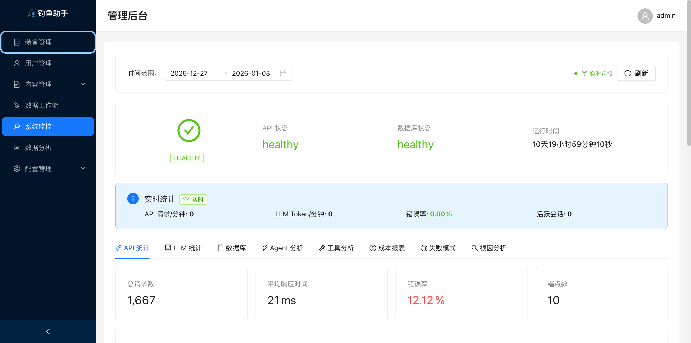 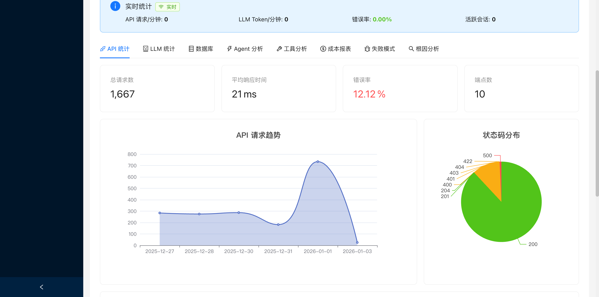

### 数据工作流
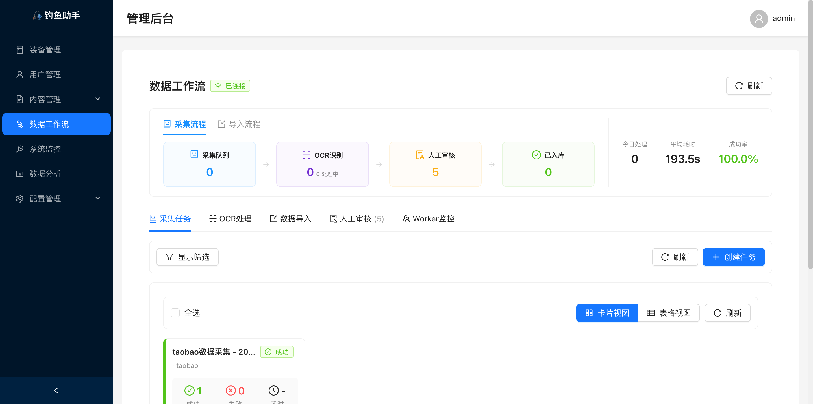 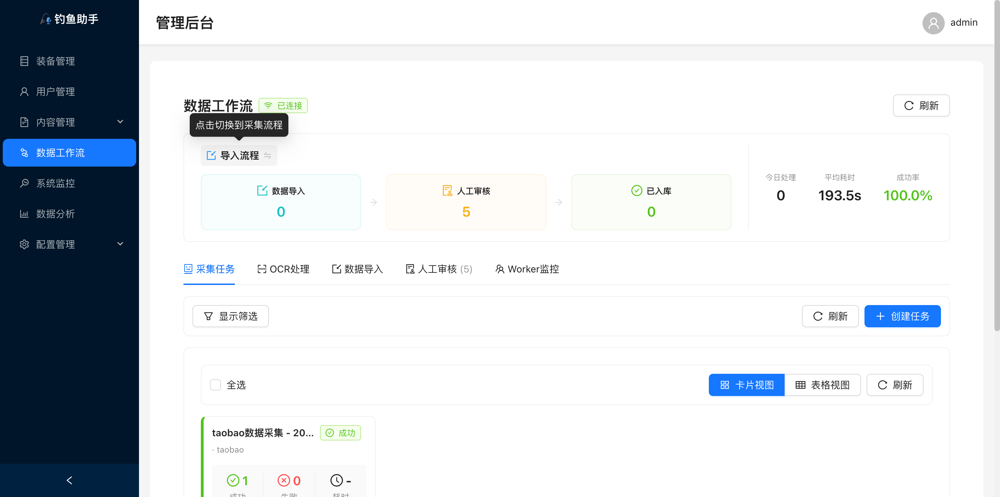

### 装备管理与 OCR
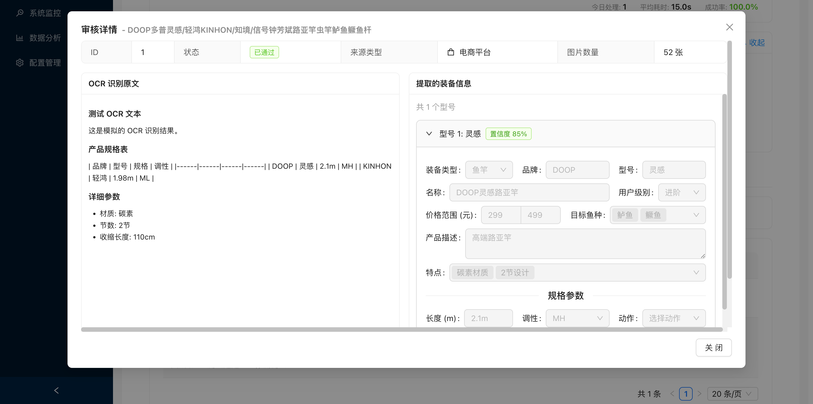 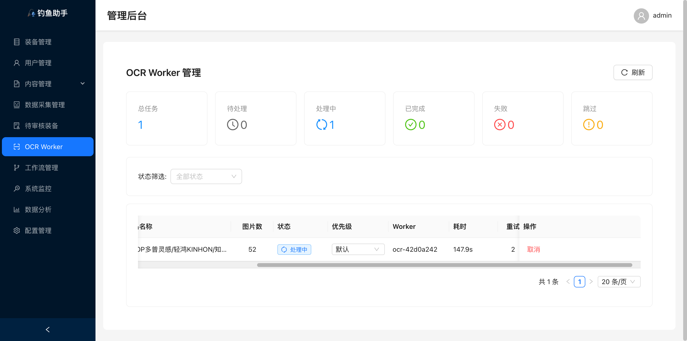

### 钓组配置与实时更新
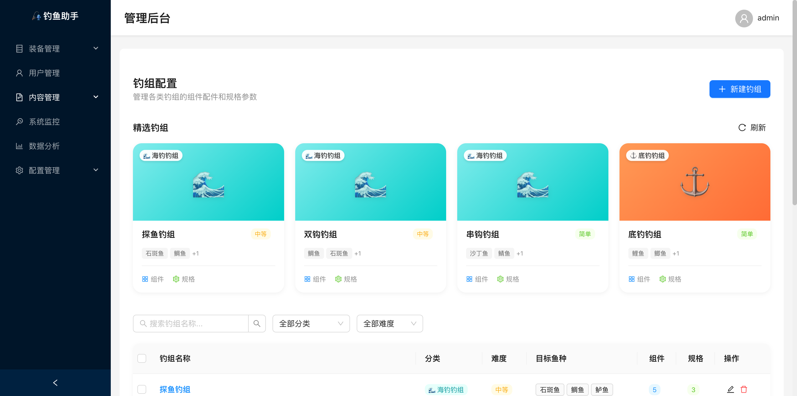 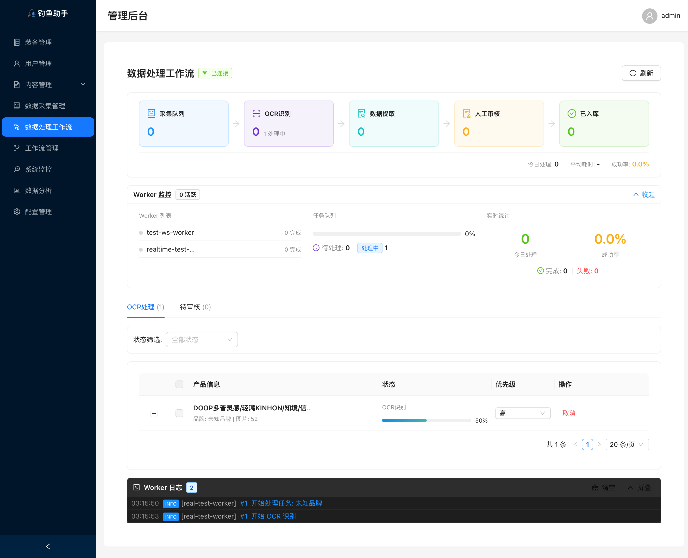

### 微信小程序
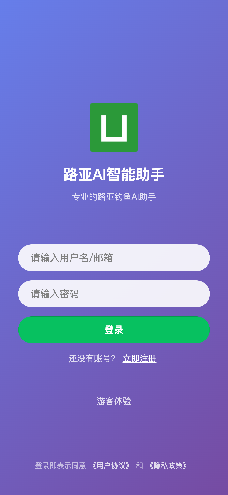 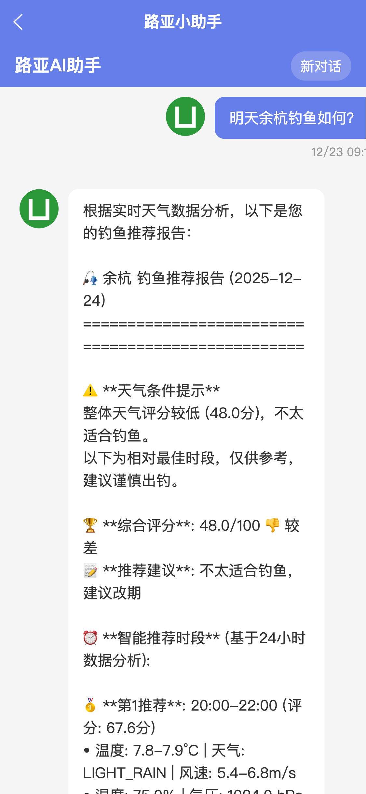 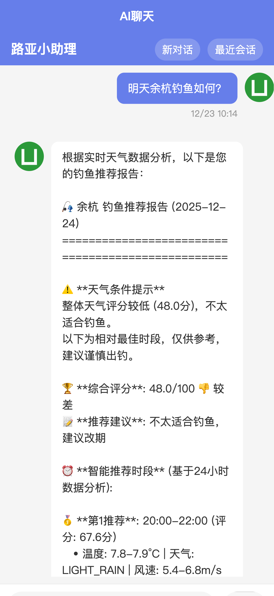

## 🚀 快速开始

### 环境要求
- Python 3.11+
- uv 包管理器
- Node.js 18+ (前端)

### 安装运行

```bash
# 1. 克隆并安装依赖
git clone <repository>
cd fishing_agent
uv sync

# 2. 配置环境变量
cp .env.example .env
# 编辑 .env 添加 API 密钥

# 3. 运行 CLI 应用
uv run python main.py

# 4. 或运行 API 服务
uv run uvicorn apps.api.main:app --reload --host 0.0.0.0 --port 8000

# 5. 运行前端（可选）
cd apps/web-admin && npm install && npm run dev
```

## 📚 文档导航

- [📖 快速入门](docs/GETTING_STARTED.md) - 详细的安装配置指南
- [🔧 API 参考](docs/API.md) - 完整的 REST API 文档
- [🖼️ 图片处理](docs/IMAGE_PROCESSING.md) - 智能图片合并和处理功能
- [👥 用户指南](docs/USER_GUIDE.md) - 详细的使用说明和示例
- [🏗️ 架构文档](docs/ARCHITECTURE.md) - 系统架构说明
- [🔄 更新日志](CHANGELOG.md) - 版本更新记录
- [🛠️ 开发指南](docs/DEVELOPMENT.md) - 开发环境搭建和贡献指南
- [🐛 故障排除](docs/TROUBLESHOOTING.md) - 常见问题解决方案
- [⚙️ 开发指令](docs/DEVELOPMENT_INSTRUCTIONS.md) - 开发环境详细说明
- [🎯 React前端](docs/REACT_FRONTEND_GUIDE.md) - React管理前端指南
- [🕷️ 爬虫指南](docs/CRAWLER_GUIDE.md) - 爬虫系统使用指南
- [🧪 测试指南](docs/TESTING.md) - 测试框架和测试说明

## 🎯 快速体验

```python
# Agent 核心功能
from packages.agents.fishing import create_agent

agent = create_agent(model_provider="zhipu")
response = agent.run("明天杭州钓鱼怎么样？")
print(response)

# 装备导入Agent
from packages.agents.equipment_import import EquipmentImportAgent

agent = EquipmentImportAgent(model_provider="zhipu")
# 对话式提取
response = agent.run("帮我识别这段文字里的装备信息")
# 或直接API调用
result = agent.extract_and_save(text="光威赤刃 GT602L-M 路亚竿", source_type="forum")

# 图片处理功能
from packages.data_processing.image import BatchMergeProcessor

processor = BatchMergeProcessor(source_dir="./images")
result = processor.process()

# 向量搜索 (新增)
from apps.api.services.vector_store import ArticleVectorStore

vector_store = ArticleVectorStore()
results = vector_store.search("钓鱼技巧", top_k=5)

# 爬虫功能
from packages.scraper.spiders import TaobaoSpider

spider = TaobaoSpider()
results = spider.crawl("target_url")
```

## 🌐 访问地址

- **API 服务器**: http://localhost:8000
- **React 管理前端**: http://localhost:5173
- **API 文档**: http://localhost:8000/docs

## 📊 技术栈

### 后端
- **Python 3.11+** - 编程语言
- **LangChain 1.0+** - LLM 应用框架
- **FastAPI** - Web 框架
- **SQLite** - 数据库
- **JWT** - 认证系统
- **APScheduler** - 任务调度
- **Playwright** - 网页自动化

### 前端
- **React 19.2.0** - 前端框架
- **TypeScript** - 类型安全
- **Ant Design 5.22.0** - UI 组件库
- **Vite** - 构建工具
- **Redux Toolkit** - 状态管理
- **ECharts** - 数据可视化

## 📄 许可证

MIT License

## 🤝 贡献

欢迎提交 Issue 和 Pull Request！

---

> 🎣 智能分析，精准钓鱼！
>
> 当前版本：v5.1.0 (Phase 7 鱼百科管理 + 内容管理系统 + Excel批量导入 + 向量搜索 + 数据分析优化 + Phase 6 智能图片合并 + 装备导入Agent + 文本压缩中间件 + Phase 5 数据分析和配置管理 + Phase 4 爬虫监控模块 + 爬虫数据持久化 + 待审核装备管理 + Phase 3 React管理前端 + Phase 2 JWT认证系统 + Phase 1 模块化Agent架构)

## 🔧 工作流管理系统

### 工作流功能特性

- **可视化编排** - 拖拽式工作流设计器，直观创建和管理工作流
- **DAG依赖管理** - 支持复杂的任务依赖关系和并行执行
- **任务调度** - 基于Cron表达式的灵活调度系统
- **实时监控** - 工作流执行状态实时追踪和日志查看
- **版本控制** - 工作流模板版本管理和回滚

### 工作流API端点

```bash
# 工作流模板管理
POST   /api/v1/admin/crawler/workflows/templates        # 创建模板
GET    /api/v1/admin/crawler/workflows/templates        # 获取模板列表
PUT    /api/v1/admin/crawler/workflows/templates/{id}   # 更新模板
DELETE /api/v1/admin/crawler/workflows/templates/{id}   # 删除模板

# 工作流执行
POST   /api/v1/admin/crawler/workflows/execute          # 执行工作流
GET    /api/v1/admin/crawler/workflows/status/{id}      # 查询执行状态
POST   /api/v1/admin/crawler/workflows/stop/{id}        # 停止执行

# 调度管理
POST   /api/v1/admin/crawler/schedules                  # 创建调度
GET    /api/v1/admin/crawler/schedules                  # 获取调度列表
PUT    /api/v1/admin/crawler/schedules/{id}             # 更新调度
DELETE /api/v1/admin/crawler/schedules/{id}             # 删除调度
```

## 🔍 OCR多提供商系统

### 支持的提供商

#### 1. Ollama (本地OCR) - 推荐使用
- **模型**: deepseek-ocr
- **优势**: 完全本地处理，保护隐私，无API调用成本
- **适用**: 对隐私要求高、有本地GPU资源的场景

#### 2. SiliconFlow (云端OCR)
- **模型**: deepseek-ai/DeepSeek-OCR
- **优势**: 识别精度高，无需本地计算资源
- **适用**: 快速验证、无本地GPU资源的场景

### 配置示例

```bash
# 使用本地Ollama (默认)
OCR_PROVIDER=ollama
OLLAMA_BASE_URL=http://localhost:11434
OLLAMA_MODEL=deepseek-ocr
OLLAMA_TIMEOUT=120

# 使用SiliconFlow云端
OCR_PROVIDER=siliconflow
SILICONFLOW_API_KEY=your-api-key
SILICONFLOW_OCR_TIMEOUT=30
```

## 📦 装备导入Agent系统

### 核心功能

装备导入Agent (agent_equipment_import) 专注于从文本中提取装备信息并存储到待审核表。

### 主要特性

- **文本压缩中间件** - 自动压缩长文本，删除冗余内容保留核心信息，压缩率可达50%+
- **批量装备提取** - 从单个长文本中提取多个装备型号，支持批量处理
- **对话式交互** - 支持自然语言对话，理解用户意图并自动调用工具
- **直接API调用** - 提供extract_and_save和batch_extract_and_save等直接API
- **智能识别** - 基于LLM的装备信息提取，支持各种装备类型识别
- **来源追踪** - 记录装备信息来源(电商/官网/论坛)，支持URL关联

### 使用示例

```python
from packages.agents.equipment_import import EquipmentImportAgent

# 创建Agent(支持文本压缩)
agent = EquipmentImportAgent(
    model_provider="zhipu",
    enable_compression=True,  # 启用文本压缩中间件
    compression_min_length=2000
)

# 对话式交互
response = agent.run("帮我从这段文字提取装备信息：光威赤刃 GT602L-M 路亚竿...")

# 批量提取并保存
results = agent.batch_extract_and_save(
    text="长文本包含多个装备型号...",
    source_type="ecommerce",
    source_url="https://example.com"
)

# 查看结果
for result in results:
    if result.success:
        print(f"成功: {result.message}, 待审核ID: {result.pending_id}")
    else:
        print(f"失败: {result.message}")
```

### 文本压缩特性

- **智能过滤** - 删除英文营销语、售后说明、技术原理图等冗余内容
- **核心保留** - 保留规格表、型号描述、技术特色、代言人等关键信息
- **元信息提取** - 自动提取品牌、系列、型号列表等元数据
- **压缩统计** - 提供详细的压缩率和内容统计信息

## 🖼️ 智能图片合并系统

### 核心功能

智能图片合并系统能够自动检测图片下方是否有文字内容，并将需要合并的图片智能批量处理。

### 主要特性

- **智能文字检测** - 基于图像特征和文件名规则的双重检测机制
- **批量处理** - 支持大量图片的并行处理和智能分组
- **高质量输出** - 支持JPEG/PNG格式，可配置输出质量和尺寸
- **元数据管理** - 自动生成合并元数据，记录处理过程和统计信息
- **多OCR支持** - 可配置使用本地或云端OCR服务

### 智能分组策略

1. **文字检测** - 分析图片底部20%区域，检测是否有文字内容
2. **文件名规则** - 识别奇数编号文件，自动与下一张合并
3. **置信度评估** - 基于暗像素比例和标准差计算检测置信度
4. **智能决策** - 综合多种因素决定是否合并相邻图片

### 使用示例

```python
from packages.data_processing.image import BatchMergeProcessor

# 创建批处理器
processor = BatchMergeProcessor(
    source_dir="./images",
    output_dir="./merged",
    quality=95,
    bottom_detection_ratio=0.2,
    ocr_confidence_threshold=0.5,
    parallel_detection=True,
    max_workers=4
)

# 执行批处理
result = processor.process()
if result["success"]:
    print(f"处理完成: {result['statistics']}")
```

### 配置参数

- `bottom_detection_ratio`: 底部检测区域比例 (默认: 0.2)
- `ocr_confidence_threshold`: OCR置信度阈值 (默认: 0.5)
- `min_text_length`: 最小文字长度 (默认: 2)
- `parallel_detection`: 是否并行检测 (默认: True)
- `max_workers`: 并行检测的最大线程数 (默认: 4)

## ✅ 待审核装备管理系统

### 核心功能

待审核装备管理系统提供完整的装备数据审核工作流，确保导入的装备数据质量。

### 主要特性

- **装备数据审核** - 管理员可以审核、批准或拒绝导入的装备数据
- **批量审核操作** - 支持批量审核多个装备，提高审核效率
- **审核状态跟踪** - 实时跟踪每个装备的审核状态（待审核/已批准/已拒绝）
- **审核历史记录** - 完整记录审核操作历史和审核意见
- **自动化工作流** - 支持自动审核规则和审核流程配置

### 审核流程

1. **数据导入** - 装备导入Agent将提取的装备信息保存到pending_equipments表
2. **待审核列表** - 管理员在React前端查看待审核装备列表
3. **审核操作** - 管理员可以批准、拒绝或需要修改装备信息
4. **数据同步** - 审核通过的装备自动同步到主装备库
5. **通知机制** - 自动通知数据导入者审核结果

## 🕷️ 爬虫数据持久化系统

### 核心功能

爬虫数据持久化系统提供完整的爬虫任务生命周期管理和数据存储。

### 主要特性

- **任务状态管理** - 完整的任务状态追踪（QUEUED/RUNNING/SUCCESS/FAILED）
- **断点续传** - 支持任务中断后从断点继续执行
- **失败重试** - 自动重试失败的任务，可配置重试次数和间隔
- **数据存储** - 爬取的装备数据自动存储到数据库
- **实时监控** - WebSocket实时推送任务执行状态和进度

### 数据持久化架构

- **任务表** - 存储爬虫任务配置和状态信息
- **日志表** - 详细记录任务执行日志和错误信息
- **数据表** - 存储爬取的装备数据和元信息
- **状态机** - 基于状态机的任务流程管理
- **队列系统** - 支持任务队列和优先级调度

## 🐛 最近修复 (v5.1.0)

- **数据分析优化** - SQL性能优化（CASE WHEN）、真实数据统计、前端增强（日期选择、CSV导出）
- **工作流重构** - 五合一工作流系统（采集/OCR/导入/审核/监控）、移除废弃页面
- **装备对比重构** - 模块化重构与差异分析增强
- **数据库字段统一** - fish_species_id → species_id 字段重命名
- **WebSocket优化** - 优化WebSocket连接处理和错误恢复

## 🐟 鱼百科管理系统 (v5.1.0 新增)

### 核心功能

鱼百科管理系统提供完整的鱼种知识库、季节活动规律和装备推荐查询功能。

### 主要特性

- **鱼种管理** - 鱼种基本信息、分类（淡水/海水/广盐）、目标鱼种
- **知识库** - 鱼种详细知识、生活习性、垂钓技巧
- **季节活动** - 春夏秋冬四季活动规律、活动等级（活跃/一般/不活跃/休眠）
- **装备推荐** - 针对不同鱼种的拟饵、钓组、装备推荐
- **分类统计** - 按分类统计鱼种数量和分布

### API端点

```bash
# 鱼种管理
GET    /api/v1/fish-species              # 银种列表
POST   /api/v1/fish-species              # 创建鱼种
GET    /api/v1/fish-species/{id}         # 鱼种详情
PUT    /api/v1/fish-species/{id}         # 更新鱼种
DELETE /api/v1/fish-species/{id}         # 删除鱼种

# 知识库管理
GET    /api/v1/fish-knowledge            # 知识库列表
POST   /api/v1/fish-knowledge            # 创建知识
GET    /api/v1/fish-knowledge/{id}       # 知识详情
PUT    /api/v1/fish-knowledge/{id}       # 更新知识
DELETE /api/v1/fish-knowledge/{id}       # 删除知识

# 季节活动管理
GET    /api/v1/fish-seasons              # 季节活动列表
POST   /api/v1/fish-seasons              # 创建季节活动
GET    /api/v1/fish-seasons/{id}         # 季节活动详情
PUT    /api/v1/fish-seasons/{id}         # 更新季节活动
DELETE /api/v1/fish-seasons/{id}         # 删除季节活动

# 装备推荐
GET    /api/v1/fish-species/{id}/equipment  # 获取鱼种装备推荐

# 统计数据
GET    /api/v1/fish-species/stats/stats    # 分类统计
GET    /api/v1/fish-species/init-data       # 初始化数据
```

## 📚 内容管理系统 (v5.1.0 新增)

### 核心功能

内容管理系统提供富文本编辑、自动保存、语义搜索和向量检索功能。

### 主要特性

- **富文本编辑器** - 支持Markdown、图片上传、代码高亮
- **自动保存草稿** - 定时自动保存，防止数据丢失
- **语义搜索** - 基于DashScope Embedding的向量搜索
- **相似文章推荐** - 基于余弦相似度的文章推荐
- **文章类型** - 技巧文章、装备评测、鱼种介绍、钓点分享
- **发布流程** - 草稿 → 审核 → 发布/归档

### API端点

```bash
# 文章管理
POST   /api/v1/articles                  # 创建文章（草稿）
GET    /api/v1/articles                  # 文章列表（支持过滤）
GET    /api/v1/articles/{id}             # 文章详情
PUT    /api/v1/articles/{id}             # 更新文章（自动保存）
DELETE /api/v1/articles/{id}             # 删除文章
POST   /api/v1/articles/{id}/publish     # 发布文章
POST   /api/v1/articles/{id}/archive     # 归档文章

# 搜索和推荐
GET    /api/v1/articles/search           # 语义搜索
GET    /api/v1/articles/{id}/similar     # 相似文章
```

### 向量存储

- **ChromaDB** - 本地向量数据库，持久化存储
- **DashScope Embedding** - 使用text-embedding-v2模型
- **自动同步** - 文章发布时自动更新向量索引
- **元数据过滤** - 支持按类型、标签、状态过滤

## 📊 Excel批量导入系统 (v5.1.0 新增)

### 核心功能

Excel批量导入系统支持将装备数据批量导入到待审核队列，提供模板生成和预览功能。

### 主要特性

- **模板生成** - 自动生成Excel/CSV导入模板
- **预览验证** - 导入前预览数据，验证格式和必填字段
- **批量导入** - 支持批量导入装备数据到pending_equipment表
- **类型映射** - 自动映射装备类型（rod/reel/line/lure）
- **规格字段** - 支持各装备类型的特定规格字段
- **错误处理** - 详细的错误信息和行号定位

### API端点

```bash
# 导入管理
POST   /api/v1/admin/workflow/import/templates  # 生成模板
POST   /api/v1/admin/workflow/import/preview    # 预览导入
POST   /api/v1/admin/workflow/import/execute    # 执行导入
```

### 支持的装备类型

- **鱼竿** - 长度、调性、动作、节数、自重、饵重范围、线负荷
- **渔轮** - 轮型、齿比、轴承数、自重、最大刹车力、线容量
- **鱼线** - 线型、线径、强度、长度、颜色、编数
- **拟饵** - 饵型、长度、重量、潜深范围、颜色、泳姿

## 🎯 配件管理系统 (v5.1.0 新增)

### 核心功能

提供钓鱼配件的完整管理功能，包括钩子、铅坠、转环、前导线等。

### 主要特性

- **配件分类** - 钩子、铅坠、转环、前导线、浮漂、别针、其他
- **规格管理** - 尺寸、材质、强度、适用场景
- **装备关联** - 关联适用的钓组和目标鱼种
- **用户等级** - 新手/进阶/高级推荐

### API端点

```bash
GET    /api/v1/accessory          # 配件列表
POST   /api/v1/accessory          # 创建配件
GET    /api/v1/accessory/{id}     # 配件详情
PUT    /api/v1/accessory/{id}     # 更新配件
DELETE /api/v1/accessory/{id}     # 删除配件
GET    /api/v1/accessory/options  # 配件选项数据
GET    /api/v1/accessory/init-data  # 初始化数据
```

## 🪝 拟饵类型管理系统 (v5.1.0 新增)

### 核心功能

提供拟饵类型的分类和管理功能，支持品牌层级管理。

### 主要特性

- **拟饵分类** - 硬饵、软饵、金属饵、飞蝇、其他
- **动作描述** - 泳姿、操作技巧
- **规格范围** - 典型重量、长度范围
- **目标鱼种** - 适用的目标鱼种
- **品牌管理** - 拟饵品牌和系列关联

### API端点

```bash
GET    /api/v1/lure-types          # 拟饵类型列表
POST   /api/v1/lure-types          # 创建拟饵类型
GET    /api/v1/lure-types/{id}     # 拟饵类型详情
PUT    /api/v1/lure-types/{id}     # 更新拟饵类型
DELETE /api/v1/lure-types/{id}     # 删除拟饵类型
GET    /api/v1/lure-types/init-data  # 初始化数据
```

## 🔧 钓组配置管理系统 (v5.1.0 新增)

### 核心功能

提供钓组配置模板管理功能，支持组件编辑器。

### 主要特性

- **钓组分类** - 底钓、浮漂、路亚、飞蝇、海钓
- **组件编辑器** - 可视化编辑钓组组件
- **规格管理** - 钓组规格参数
- **拟饵关联** - 关联适用的拟饵类型
- **难度评级** - 简单/中等/困难

### API端点

```bash
GET    /api/v1/rigs                # 钓组列表
POST   /api/v1/rigs                # 创建钓组
GET    /api/v1/rigs/{id}           # 钓组详情
PUT    /api/v1/rigs/{id}           # 更新钓组
DELETE /api/v1/rigs/{id}           # 删除钓组
GET    /api/v1/rigs/options        # 钓组选项数据
```