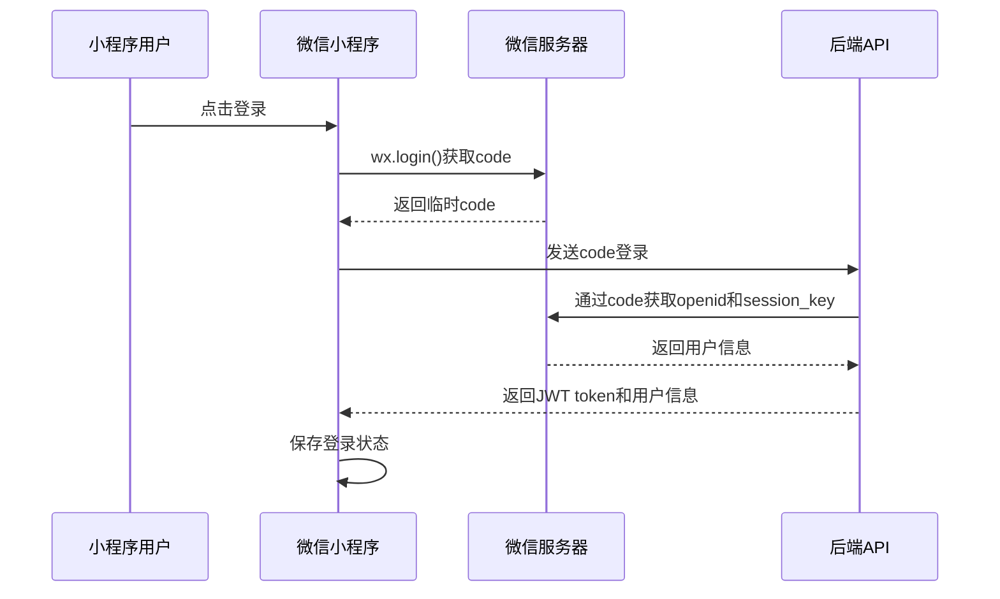

# 微信小程序集成指南 v5.0.2

详细说明如何将智能钓鱼助手功能集成到微信小程序中，包括登录认证、API调用、功能实现等。

## 📋 目录

- [集成概览](#集成概览)
- [开发环境准备](#开发环境准备)
- [小程序登录](#小程序登录)
- [API接口封装](#api接口封装)
- [核心功能实现](#核心功能实现)
- [数据持久化](#数据持久化)
- [性能优化](#性能优化)
- [发布和审核](#发布和审核)
- [常见问题](#常见问题)

## 🎯 集成概览

### 核心功能
- **微信登录**: 基于微信开放平台的用户认证
- **智能对话**: 钓鱼推荐和咨询功能
- **装备管理**: 个人装备信息管理
- **天气查询**: 实时天气和钓鱼建议
- **数据同步**: 与后端系统的数据同步

### 技术架构
```
微信小程序
    ↓
API封装层
    ↓
JWT认证
    ↓
智能钓鱼助手API
    ↓
业务逻辑处理
```

## 🛠️ 开发环境准备

### 微信开发者工具
1. **下载安装**
   - 访问[微信开发者工具官网](https://developers.weixin.qq.com/miniprogram/dev/devtools/download.html)
   - 下载对应平台的安装包
   - 安装并启动开发者工具

2. **项目创建**
   - 选择"小程序项目"
   - 输入AppID（测试可使用测试号）
   - 选择"JavaScript"模板
   - 填写项目名称和目录

### 开发环境配置

#### 项目结构
```
miniprogram/
├── app.js                 # 小程序入口文件
├── app.json              # 全局配置文件
├── app.wxss              # 全局样式文件
├── pages/                 # 页面目录
│   ├── index/            # 首页
│   ├── chat/             # 对话页面
│   ├── equipment/        # 装备管理
│   └── profile/          # 个人中心
├── components/           # 组件目录
├── utils/               # 工具函数
│   ├── api.js           # API接口封装
│   ├── auth.js          # 认证相关
│   └── storage.js       # 本地存储
└── images/              # 图片资源
```

#### 配置文件
```javascript
// app.json
{
  "pages": [
    "pages/index/index",
    "pages/chat/chat",
    "pages/equipment/equipment",
    "pages/profile/profile"
  ],
  "window": {
    "backgroundTextStyle": "light",
    "navigationBarBackgroundColor": "#fff",
    "navigationBarTitleText": "智能钓鱼助手",
    "navigationBarTextStyle": "black"
  },
  "tabBar": {
    "color": "#7A7E83",
    "selectedColor": "#3cc51f",
    "borderStyle": "black",
    "backgroundColor": "#ffffff",
    "list": [
      {
        "pagePath": "pages/index/index",
        "iconPath": "images/home.png",
        "selectedIconPath": "images/home-active.png",
        "text": "首页"
      },
      {
        "pagePath": "pages/chat/chat",
        "iconPath": "images/chat.png", 
        "selectedIconPath": "images/chat-active.png",
        "text": "对话"
      },
      {
        "pagePath": "pages/equipment/equipment",
        "iconPath": "images/equipment.png",
        "selectedIconPath": "images/equipment-active.png", 
        "text": "装备"
      },
      {
        "pagePath": "pages/profile/profile",
        "iconPath": "images/profile.png",
        "selectedIconPath": "images/profile-active.png",
        "text": "我的"
      }
    ]
  },
  "permission": {
    "scope.userLocation": {
      "desc": "您的位置信息将用于为您推荐附近的钓鱼地点"
    }
  },
  "sitemapLocation": "sitemap.json"
}
```

## 🔐 小程序登录

### 登录流程


### 登录实现代码

#### 1. 获取用户信息
```javascript
// utils/auth.js
const login = () => {
  return new Promise((resolve, reject) => {
    wx.login({
      success: (res) => {
        if (res.code) {
          // 发送code到后端
          wx.request({
            url: `${app.globalData.baseURL}/api/v1/auth/wechat/login`,
            method: 'POST',
            data: {
              code: res.code
            },
            success: (response) => {
              if (response.data.access_token) {
                // 保存登录状态
                wx.setStorageSync('token', response.data.access_token)
                wx.setStorageSync('user', response.data.user)
                resolve(response.data)
              } else {
                reject(new Error('登录失败'))
              }
            },
            fail: (error) => {
              reject(error)
            }
          })
        } else {
          reject(new Error('获取登录凭证失败'))
        }
      },
      fail: (error) => {
        reject(error)
      }
    })
  })
}
```

#### 2. 获取用户授权
```javascript
// 获取用户授权
const getUserProfile = () => {
  return new Promise((resolve, reject) => {
    wx.getUserProfile({
      desc: '用于完善用户资料',
      success: (res) => {
        resolve(res.userInfo)
      },
      fail: (error) => {
        reject(error)
      }
    })
  })
}
```

#### 3. 检查登录状态
```javascript
// 检查登录状态
const checkLogin = () => {
  const token = wx.getStorageSync('token')
  const user = wx.getStorageSync('user')
  
  if (token && user) {
    return { isLoggedIn: true, token, user }
  } else {
    return { isLoggedIn: false }
  }
}
```

## 🌐 API接口封装

### 基础配置
```javascript
// utils/api.js
const baseURL = 'https://api.fishing-agent.com' // 生产环境
// const baseURL = 'http://localhost:8000' // 开发环境

// 网络请求封装
const request = (options) => {
  const token = wx.getStorageSync('token')
  
  return new Promise((resolve, reject) => {
    wx.request({
      url: `${baseURL}${options.url}`,
      method: options.method || 'GET',
      data: options.data || {},
      header: {
        'Content-Type': 'application/json',
        'Authorization': token ? `Bearer ${token}` : '',
        ...options.header
      },
      success: (res) => {
        if (res.statusCode === 200) {
          resolve(res.data)
        } else if (res.statusCode === 401) {
          // Token过期，跳转登录
          wx.removeStorageSync('token')
          wx.removeStorageSync('user')
          wx.navigateTo({
            url: '/pages/index/index'
          })
          reject(new Error('登录已过期'))
        } else {
          reject(new Error(res.data.message || '请求失败'))
        }
      },
      fail: (error) => {
        reject(error)
      }
    })
  })
}
```

### API接口定义
```javascript
// 钓鱼相关API
const fishingAPI = {
  // 智能对话
  chat: (query, model = 'zhipu') => {
    return request({
      url: '/api/v1/fishing/chat',
      method: 'POST',
      data: {
        query: query,
        model_provider: model
      }
    })
  },
  
  // 获取钓鱼推荐
  getRecommendation: (location, date) => {
    return request({
      url: '/api/v1/fishing/recommendation',
      method: 'POST',
      data: {
        location: location,
        date: date
      }
    })
  }
}

// 装备相关API
const equipmentAPI = {
  // 获取装备列表
  getList: (params = {}) => {
    return request({
      url: '/api/v1/equipment/list',
      method: 'GET',
      data: params
    })
  },
  
  // 搜索装备
  search: (keyword, filters = {}) => {
    return request({
      url: '/api/v1/equipment/search',
      method: 'POST',
      data: {
        keyword: keyword,
        filters: filters
      }
    })
  },
  
  // 添加装备
  add: (equipment) => {
    return request({
      url: '/api/v1/equipment',
      method: 'POST',
      data: equipment
    })
  }
}

// 用户相关API
const userAPI = {
  // 获取用户信息
  getProfile: () => {
    return request({
      url: '/api/v1/user/profile',
      method: 'GET'
    })
  },
  
  // 更新用户信息
  updateProfile: (profile) => {
    return request({
      url: '/api/v1/user/profile',
      method: 'PUT',
      data: profile
    })
  }
}

module.exports = {
  fishingAPI,
  equipmentAPI,
  userAPI,
  request
}
```

## 💬 核心功能实现

### 对话页面实现

#### 页面结构
```html
<!-- pages/chat/chat.wxml -->
<view class="container">
  <view class="messages" scroll-y="true" scroll-into-view="{{toView}}">
    <view 
      wx:for="{{messages}}" 
      wx:key="id" 
      id="msg-{{item.id}}"
      class="message {{item.isUser ? 'user' : 'ai'}}"
    >
      <image 
        wx:if="{{!item.isUser}}" 
        class="avatar" 
        src="/images/ai-avatar.png"
      />
      <view class="content">{{item.content}}</view>
      <image 
        wx:if="{{item.isUser}}" 
        class="avatar" 
        src="{{user.avatarUrl}}"
      />
    </view>
  </view>
  
  <view class="input-area">
    <input 
      class="input" 
      value="{{inputText}}"
      placeholder="请输入您的问题..."
      bindinput="onInputChange"
      bindconfirm="sendMessage"
      confirm-type="send"
    />
    <button 
      class="send-btn" 
      bindtap="sendMessage"
      disabled="{{sending}}"
    >
      发送
    </button>
  </view>
</view>
```

#### 页面逻辑
```javascript
// pages/chat/chat.js
const { fishingAPI } = require('../../utils/api')

Page({
  data: {
    messages: [],
    inputText: '',
    sending: false,
    toView: '',
    user: null
  },

  onLoad() {
    this.loadUser()
    this.loadMessages()
  },

  // 加载用户信息
  loadUser() {
    const user = wx.getStorageSync('user')
    this.setData({ user })
  },

  // 加载历史消息
  loadMessages() {
    const messages = wx.getStorageSync('chat_messages') || []
    this.setData({ 
      messages,
      toView: messages.length > 0 ? `msg-${messages[messages.length - 1].id}` : ''
    })
  },

  // 输入框变化
  onInputChange(e) {
    this.setData({
      inputText: e.detail.value
    })
  },

  // 发送消息
  sendMessage() {
    const { inputText, messages } = this.data
    
    if (!inputText.trim()) {
      wx.showToast({
        title: '请输入内容',
        icon: 'none'
      })
      return
    }

    // 添加用户消息
    const userMessage = {
      id: Date.now(),
      content: inputText.trim(),
      isUser: true,
      timestamp: new Date().toISOString()
    }

    // 更新界面
    this.setData({
      messages: [...messages, userMessage],
      inputText: '',
      sending: true,
      toView: `msg-${userMessage.id}`
    })

    // 保存消息
    this.saveMessages()

    // 调用AI接口
    this.callAI(userMessage.content)
  },

  // 调用AI接口
  async callAI(query) {
    try {
      const response = await fishingAPI.chat(query)
      
      const aiMessage = {
        id: Date.now(),
        content: response.response,
        isUser: false,
        timestamp: new Date().toISOString()
      }

      this.setData({
        messages: [...this.data.messages, aiMessage],
        sending: false,
        toView: `msg-${aiMessage.id}`
      })

      this.saveMessages()
      
    } catch (error) {
      console.error('AI调用失败:', error)
      
      wx.showToast({
        title: '网络异常，请重试',
        icon: 'none'
      })
      
      this.setData({ sending: false })
    }
  },

  // 保存消息到本地存储
  saveMessages() {
    wx.setStorageSync('chat_messages', this.data.messages)
  }
})
```

#### 页面样式
```css
/* pages/chat/chat.wxss */
.container {
  height: 100vh;
  display: flex;
  flex-direction: column;
  padding: 0;
  margin: 0;
}

.messages {
  flex: 1;
  padding: 20rpx;
  overflow-y: auto;
}

.message {
  display: flex;
  margin-bottom: 30rpx;
  align-items: flex-start;
}

.message.user {
  flex-direction: row-reverse;
}

.message .content {
  max-width: 70%;
  padding: 20rpx 30rpx;
  border-radius: 10rpx;
  font-size: 28rpx;
  line-height: 1.5;
  margin: 0 20rpx;
}

.message.ai .content {
  background-color: #f5f5f5;
  color: #333;
}

.message.user .content {
  background-color: #07c160;
  color: #fff;
}

.avatar {
  width: 60rpx;
  height: 60rpx;
  border-radius: 50%;
}

.input-area {
  display: flex;
  padding: 20rpx;
  background-color: #fff;
  border-top: 1rpx solid #eee;
}

.input {
  flex: 1;
  height: 80rpx;
  border: 1rpx solid #ddd;
  border-radius: 10rpx;
  padding: 0 20rpx;
  margin-right: 20rpx;
  font-size: 28rpx;
}

.send-btn {
  height: 80rpx;
  padding: 0 40rpx;
  background-color: #07c160;
  color: #fff;
  border: none;
  border-radius: 10rpx;
  font-size: 28rpx;
}

.send-btn:disabled {
  background-color: #ccc;
}
```

### 装备管理页面

#### 装备列表
```javascript
// pages/equipment/equipment.js
const { equipmentAPI } = require('../../utils/api')

Page({
  data: {
    equipmentList: [],
    loading: false,
    keyword: '',
    categories: ['全部', '路亚竿', '纺车轮', '鱼线', '拟饵'],
    currentCategory: 0
  },

  onLoad() {
    this.loadEquipment()
  },

  // 加载装备列表
  async loadEquipment() {
    this.setData({ loading: true })
    
    try {
      const response = await equipmentAPI.getList()
      this.setData({
        equipmentList: response.data || [],
        loading: false
      })
    } catch (error) {
      console.error('加载装备失败:', error)
      this.setData({ loading: false })
    }
  },

  // 搜索装备
  async searchEquipment() {
    const { keyword, currentCategory } = this.data
    
    if (!keyword.trim()) {
      this.loadEquipment()
      return
    }

    this.setData({ loading: true })
    
    try {
      const category = this.data.categories[currentCategory]
      const filters = category !== '全部' ? { category } : {}
      
      const response = await equipmentAPI.search(keyword, filters)
      this.setData({
        equipmentList: response.data || [],
        loading: false
      })
    } catch (error) {
      console.error('搜索失败:', error)
      this.setData({ loading: false })
    }
  },

  // 分类选择
  onCategoryChange(e) {
    this.setData({
      currentCategory: e.detail.value
    })
    this.loadEquipment()
  },

  // 输入搜索
  onSearchInput(e) {
    this.setData({
      keyword: e.detail.value
    })
  },

  // 确认搜索
  onSearchConfirm() {
    this.searchEquipment()
  }
})
```

## 💾 数据持久化

### 本地存储管理
```javascript
// utils/storage.js
const storage = {
  // 保存数据
  set: (key, data) => {
    try {
      wx.setStorageSync(key, data)
      return true
    } catch (error) {
      console.error('保存数据失败:', error)
      return false
    }
  },

  // 读取数据
  get: (key, defaultValue = null) => {
    try {
      return wx.getStorageSync(key) || defaultValue
    } catch (error) {
      console.error('读取数据失败:', error)
      return defaultValue
    }
  },

  // 删除数据
  remove: (key) => {
    try {
      wx.removeStorageSync(key)
      return true
    } catch (error) {
      console.error('删除数据失败:', error)
      return false
    }
  },

  // 清空所有数据
  clear: () => {
    try {
      wx.clearStorageSync()
      return true
    } catch (error) {
      console.error('清空数据失败:', error)
      return false
    }
  }
}

// 数据管理器
const dataManager = {
  // 保存聊天记录
  saveChatMessages: (messages) => {
    storage.set('chat_messages', messages)
  },

  // 获取聊天记录
  getChatMessages: () => {
    return storage.get('chat_messages', [])
  },

  // 保存用户偏好设置
  saveUserPreferences: (preferences) => {
    storage.set('user_preferences', preferences)
  },

  // 获取用户偏好设置
  getUserPreferences: () => {
    return storage.get('user_preferences', {
      theme: 'light',
      language: 'zh-CN',
      autoSave: true
    })
  },

  // 保存装备收藏
  saveFavoriteEquipment: (equipment) => {
    const favorites = storage.get('favorite_equipment', [])
    if (!favorites.find(item => item.id === equipment.id)) {
      favorites.push(equipment)
      storage.set('favorite_equipment', favorites)
    }
  },

  // 获取装备收藏
  getFavoriteEquipment: () => {
    return storage.get('favorite_equipment', [])
  }
}

module.exports = {
  storage,
  dataManager
}
```

## ⚡ 性能优化

### 图片懒加载
```javascript
// components/lazy-image/lazy-image.js
Component({
  properties: {
    src: String,
    placeholder: {
      type: String,
      value: '/images/placeholder.png'
    }
  },

  data: {
    loaded: false,
    inViewport: false
  },

  methods: {
    // 检查是否在视口内
    checkViewport() {
      const query = wx.createSelectorQuery()
      query.select('.lazy-image').boundingClientRect()
      query.exec((res) => {
        if (res[0]) {
          const { top } = res[0]
          const inViewport = top < wx.getSystemInfoSync().windowHeight
          
          if (inViewport && !this.data.loaded) {
            this.loadImage()
          }
          
          this.setData({ inViewport })
        }
      })
    },

    // 加载图片
    loadImage() {
      wx.getImageInfo({
        src: this.data.src,
        success: () => {
          this.setData({
            loaded: true
          })
        }
      })
    }
  },

  attached() {
    this.checkViewport()
  },

  pageLifetimes: {
    show() {
      this.checkViewport()
    }
  }
})
```

### 分页加载
```javascript
// pages/equipment/equipment.js
Page({
  data: {
    equipmentList: [],
    page: 1,
    pageSize: 20,
    hasMore: true,
    loading: false
  },

  onLoad() {
    this.loadEquipment()
  },

  // 加载装备列表
  async loadEquipment() {
    if (!this.data.hasMore || this.data.loading) return

    this.setData({ loading: true })

    try {
      const response = await equipmentAPI.getList({
        page: this.data.page,
        pageSize: this.data.pageSize
      })

      const newList = response.data || []
      const hasMore = newList.length === this.data.pageSize

      this.setData({
        equipmentList: [...this.data.equipmentList, ...newList],
        page: this.data.page + 1,
        hasMore,
        loading: false
      })

    } catch (error) {
      console.error('加载装备失败:', error)
      this.setData({ loading: false })
    }
  },

  // 触底加载更多
  onReachBottom() {
    this.loadEquipment()
  }
})
```

### 防抖处理
```javascript
// utils/debounce.js
const debounce = (func, wait = 300) => {
  let timeout
  return function executedFunction(...args) {
    const later = () => {
      clearTimeout(timeout)
      func(...args)
    }
    clearTimeout(timeout)
    timeout = setTimeout(later, wait)
  }
}

module.exports = debounce
```

## 🚀 发布和审核

### 发布流程

#### 1. 代码检查
```bash
# 代码格式检查
npm run lint

# 代码压缩
npm run build

# 功能测试
npm run test
```

#### 2. 版本管理
```json
// project.config.json
{
  "appid": "your-appid",
  "projectname": "智能钓鱼助手",
  "description": "智能钓鱼推荐小程序",
  "setting": {
    "urlCheck": true,
    "es6": true,
    "postcss": true,
    "minified": true
  },
  "compileType": "miniprogram"
}
```

#### 3. 上传发布
1. **开发者工具** - 点击"上传"按钮
2. **版本号** - 填写版本号和项目备注
3. **功能页面** - 添加功能说明
4. **测试账号** - 提供测试账号和密码
5. **提交审核** - 提交微信审核

### 审核要点

#### 必备内容
- **隐私政策**：用户数据收集和使用说明
- **用户协议**：服务条款和使用规范
- **权限说明**：位置、存储等权限使用说明
- **客服联系方式**：客服电话和邮箱

#### 常见审核问题
1. **权限使用不合理**：确保权限使用有明确说明
2. **隐私政策不完整**：需要详细的隐私保护措施
3. **功能描述不清晰**：功能页面需要详细说明
4. **测试功能不完整**：确保所有功能都能正常使用

## ❓ 常见问题

### Q: 如何获取AppID？

**A**: 
1. 访问[微信公众平台](https://mp.weixin.qq.com/)
2. 注册小程序账号
3. 完成信息认证（个人或企业）
4. 在"开发"-"开发设置"中查看AppID

### Q: 调试时遇到跨域问题怎么办？

**A**: 
1. 在开发者工具中"详情"-"本地设置"勾选"不校验合法域名、web-view（业务域名）、TLS版本以及HTTPS证书"
2. 生产环境需要配置合法域名

### Q: 用户登录失败怎么办？

**A**: 
1. 检查AppID和AppSecret是否正确
2. 确认后端API接口是否正常
3. 检查网络连接状态
4. 查看开发者工具网络请求详情

### Q: 小程序包体积过大怎么办？

**A**: 
1. 使用分包加载策略
2. 压缩图片资源
3. 使用外部CDN存储静态资源
4. 代码分包和懒加载

### Q: 如何处理网络异常？

**A**: 
1. 实现网络重试机制
2. 添加网络状态检测
3. 提供离线模式支持
4. 显示友好的错误提示

---

**指南版本**: v5.0.2  
**最后更新**: 2024-12-20  
**相关功能**: 微信登录、API集成、数据同步